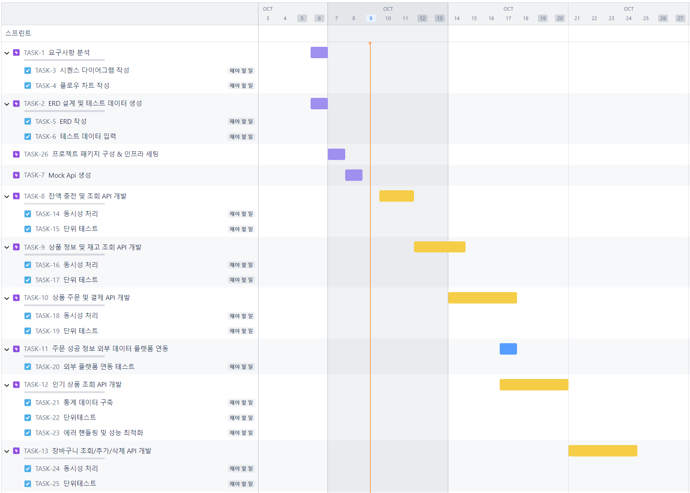
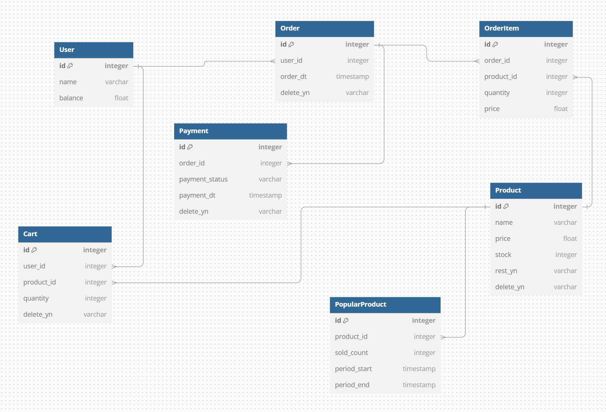

# E-Commerce

## TODO
- Step5
  - [x] 시나리오 선정 및 프로젝트 Milestone 제출
  - [x] 시나리오 요구사항 별 분석 자료 제출
  - [x] 자료들을 리드미에 작성 후 PR 링크 제출
- Step6
  - [x] ERD 설계 자료 제출
  - [x] API 명세 및 Mock API 작성
  - [x] 자료들을 리드미에 작성 후 PR링크 제출 ( 채택할 기본 패키지 구조, 기술 스택 등 )

<br/>

## 시나리오 선정 이유
``
e커머스와 관련된 핵심 기능을 구현하면서 실무에서 고민될 동시성 이슈 처리, 성능 최적화, 단위 테스트 등을 경험해 보기 위해 이 시나리오를 선정했습니다.
또한, 재고 관리와 상품 추천처럼 복잡한 비즈니스 로직과 데이터 흐름을 다루며, 특히 인기 상품 추천을 위해 외부 데이터 플랫폼과의 연동을 구현함으로써 외부 시스템을 고려한 아키텍처 설계를 경험할 수 있습니다.
``

<br/>

## 전체 Milestone


<br/>

## 시퀀스 다이어그램

[[전체 프로세스] <- 클릭](diagram/DiagramAll.md)

[[잔액 충전/조회] <- 클릭](diagram/DiagramApi1.md)

[[상품 조회] <- 클릭](diagram/DiagramApi2.md)

[[주문/결제] <- 클릭](diagram/DiagramApi3.md)

[[인기 상품 조회] <- 클릭](diagram/DiagramApi4.md)

[[장바구니 조회/추가/삭제 <- 클릭]](diagram/DiagramApi5.md)


<br/>

## ERD
``
도메인 엔티티를 각각 분리하여 설계하여, 추후 특정 테이블의 컬럼이 추가, 변경, 삭제되더라도 다른 테이블에 영향을 주지 않도록 하였습니다. 또한, Order와 Product 사이에 매핑 테이블인 OrderItem을 두어 하나의 주문에 대해 여러 개의 상품 주문 상태를 관리할 수 있도록 하였습니다. 각 테이블에는 delete_yn 컬럼을 추가하여 삭제된 데이터도 쉽게 조회할 수 있게 하였습니다.
``



## API 명세
[API DOCS YML 파일 <- 클릭](diagram/ApiDocs.yml)
### 1. 잔액 충전/조회
##### 1.1 잔액 조회
- HTTP Method: `GET`
- Endpoint: `/user/balance`
- **요청 파라미터**:
  - `userId`: (Long) 사용자 ID
- **응답**:
  - **상태 코드**: 200 OK
  - **응답 바디**: 사용자 잔액(Double)

##### 1.2 잔액 충전
- HTTP Method: `POST`
- Endpoint: `/user/balance/charge`
- **요청 파라미터**:
  - `userId`: (Long) 사용자 ID
  - `amount`: (Double) 충전할 금액
- **응답**:
  - **상태 코드**: 200 OK
  - **응답 바디**: 사용자 정보(User 객체)

#### 2. 상품 조회
##### 2.1 상품 조회
- HTTP Method: `GET`
- Endpoint: `/product/all`
- **응답**:
  - **상태 코드**: 200 OK
  - **응답 바디**: 상품 목록 (Product 객체)

##### 2.2 인기 상품 조회
- HTTP Method: `GET`
- Endpoint: `/product/popular`
- **응답**:
  - **상태 코드**: 200 OK
  - **응답 바디**: 상품 목록 (Product 객체)

#### 3. 주문/결제
- HTTP Method: `POST`
- Endpoint: `/order/checkout`
- **요청 파라미터**:
  - `userId`: (Long) 사용자 ID
  - `productId`: (Long) 상품 ID
  - `quantity`: (Integer) 주문 수량
- **응답**:
  - **상태 코드**: 200 OK
  - **응답 바디**: 주문 정보 (Order 객체)

#### 4. 장바구니
- 고도화 시 구현 예정


<br/>

### ✔️기술 스택


<br/>


### 패키지 구조
``
"레이어형 클린 아키텍처"를 채택했습니다. 도메인(비즈니스) 계층이 중심이 되어, 데이터 계층이나 인프라 계층이 변경되더라도 도메인 로직에 영향을 주지 않도록 설계되었습니다.
또 특정 기술에 의존하지 않기 때문에 확장성이 높고 기능 수정이나 개선 작업이 다른 계층에 미치는 영향을 최소화할 수 있습니다.
``
```
 ecommerce
   ├─ EcommerceApplication.java
   ├─ order
   │  ├─ application
   │  │  ├─ service   : 비즈니스 로직을 처리하는 서비스
   │  │  │  ├─ OrderService.java
   │  │  │  ├─ PaymentService.java
   │  │  │  ├─ ProductService.java
   │  │  │  └─ UserService.java
   │  │  └─ usecase
   │  │     └─ OrderServiceApplication.java
   │  ├─ domain
   │  │  ├─ Cart.java
   │  │  ├─ Order.java
   │  │  ├─ Payment.java
   │  │  ├─ Product.java
   │  │  ├─ repository
   │  │  │  ├─ OrderRepository.java
   │  │  │  ├─ ProductRepository.java
   │  │  │  └─ UserRepository.java
   │  │  └─ User.java
   │  ├─ exception
   │  ├─ infra    :데이터베이스와 상호작용하는 DAO 및 리포지토리
   │  │  ├─ entity
   │  │  │  ├─ CartEntity.java
   │  │  │  ├─ OrderEntity.java
   │  │  │  ├─ OrderItemEntity.java
   │  │  │  ├─ PaymentEntity.java
   │  │  │  ├─ ProductEntity.java
   │  │  │  └─ UserEntity.java
   │  │  └─ repository
   │  │     ├─ impl
   │  │     │  └─ OrderJpaRepositoryImpl.java
   │  │     ├─ OrderJpaRepository.java
   │  │     ├─ ProductJpaRepository.java
   │  │     └─ UserJpaRepository.java
   │  └─ interfaces
   │     ├─ controller
   │     │  ├─ OrderController.java
   │     │  ├─ ProductController.java
   │     │  └─ UserController.java
   │     └─ dto
   │        ├─ OrderRequestDto.java
   │        └─ UserRequestDto.java


```