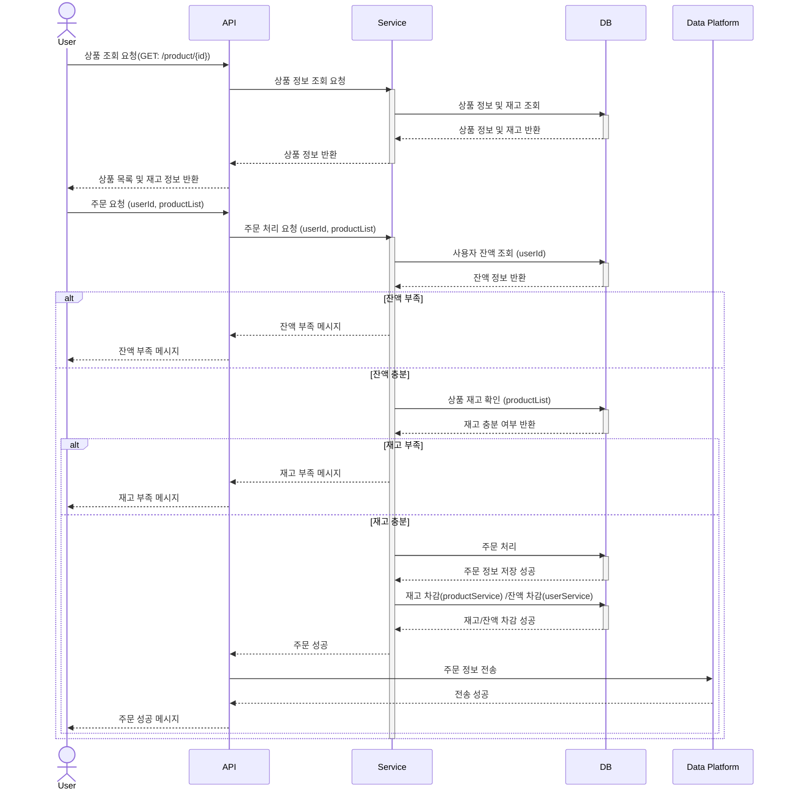

##  e-커머스 주문 서비스 전체 프로세스

```mermaid
sequenceDiagram
    actor User
    participant API
    participant Service
    participant DB
    participant Data Platform

%% 상품 조회 및 재고 확인
    User->>API: 상품 조회 요청(GET: /product/{id})
    API->>Service: 상품 정보 조회 요청
    activate Service
    Service->>DB: 상품 정보 및 재고 조회
    activate DB
    DB-->>Service: 상품 정보 및 재고 반환
    deactivate DB
    Service-->>API: 상품 정보 반환
    deactivate Service
    API-->>User: 상품 목록 및 재고 정보 반환

%% 주문 요청 및 잔액/재고 확인
    User->>API: 주문 요청 (userId, productList)
    API->>Service: 주문 처리 요청 (userId, productList)
    activate Service
    Service->>DB: 사용자 잔액 조회 (userId)
    activate DB
    DB-->>Service: 잔액 정보 반환
    deactivate DB
    alt 잔액 부족
        Service-->>API: 잔액 부족 메시지
        API-->>User: 잔액 부족 메시지
    else 잔액 충분
        Service->>DB: 상품 재고 확인 (productList)
        activate DB
        DB-->>Service: 재고 충분 여부 반환
        deactivate DB
        alt 재고 부족
            Service-->>API: 재고 부족 메시지
            API-->>User: 재고 부족 메시지
        else 재고 충분
            Service->>DB: 주문 처리
            activate DB
            DB-->>Service: 주문 정보 저장 성공
            deactivate DB
            Service->>DB: 재고 차감(productService) /잔액 차감(userService)
            activate DB
            DB-->>Service: 재고/잔액 차감 성공
            deactivate DB
            Service-->>API: 주문 성공
            API->>Data Platform: 주문 정보 전송
            Data Platform-->>API: 전송 성공
            API-->>User: 주문 성공 메시지
        end
    end
    deactivate Service
```