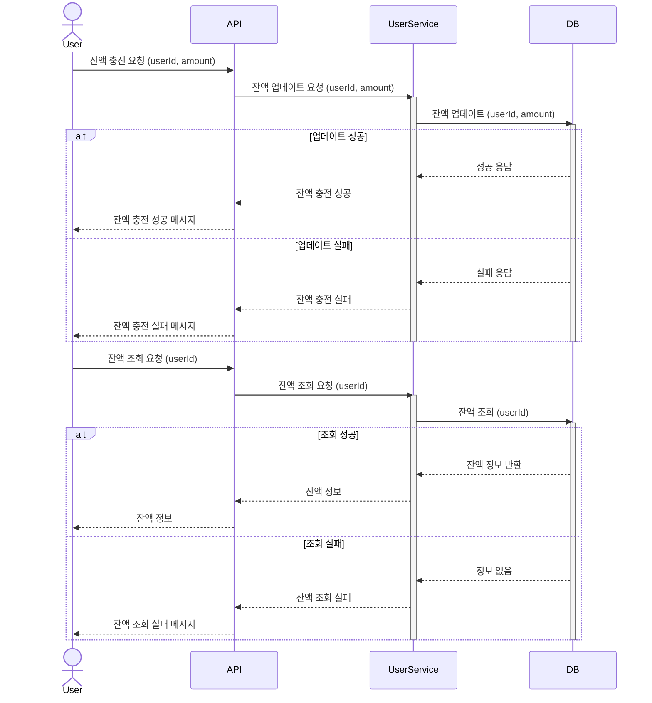

## 잔액 충전/조회 API

```mermaid
sequenceDiagram
    actor User
    participant API
    participant UserService
    participant DB

%% 잔액 충전
    User->>API: 잔액 충전 요청 (userId, amount)
    API->>UserService: 잔액 업데이트 요청 (userId, amount)
    activate UserService
    UserService->>DB: 잔액 업데이트 (userId, amount)
    activate DB
    alt 업데이트 성공
        DB-->>UserService: 성공 응답
        UserService-->>API: 잔액 충전 성공
        API-->>User: 잔액 충전 성공 메시지
    else 업데이트 실패
        DB-->>UserService: 실패 응답
        UserService-->>API: 잔액 충전 실패
        API-->>User: 잔액 충전 실패 메시지
    end
    deactivate DB
    deactivate UserService

%% 잔액 조회
    User->>API: 잔액 조회 요청 (userId)
    API->>UserService: 잔액 조회 요청 (userId)
    activate UserService
    UserService->>DB: 잔액 조회 (userId)
    activate DB
    alt 조회 성공
        DB-->>UserService: 잔액 정보 반환
        UserService-->>API: 잔액 정보
        API-->>User: 잔액 정보
    else 조회 실패
        DB-->>UserService: 정보 없음
        UserService-->>API: 잔액 조회 실패
        API-->>User: 잔액 조회 실패 메시지
    end
    deactivate DB
    deactivate UserService

```