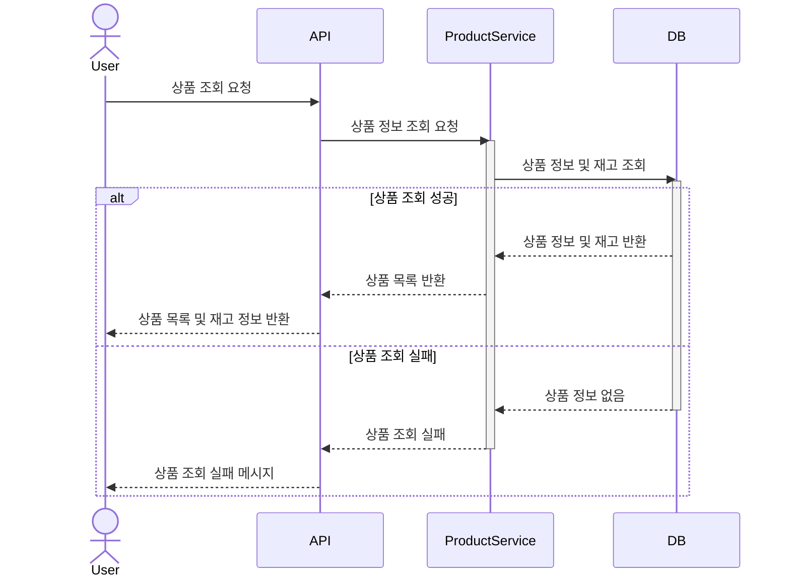

## 상품 조회 API

```mermaid
sequenceDiagram
    actor User
    participant API
    participant ProductService
    participant DB

    User->>API: 상품 조회 요청
    API->>ProductService: 상품 정보 조회 요청
    activate ProductService
    ProductService->>DB: 상품 정보 및 재고 조회
    activate DB
    alt 상품 조회 성공
        DB-->>ProductService: 상품 정보 및 재고 반환
        ProductService-->>API: 상품 목록 반환
        API-->>User: 상품 목록 및 재고 정보 반환
    else 상품 조회 실패
        DB-->>ProductService: 상품 정보 없음
        deactivate DB
        ProductService-->>API: 상품 조회 실패
        deactivate ProductService
        API-->>User: 상품 조회 실패 메시지
    end

```