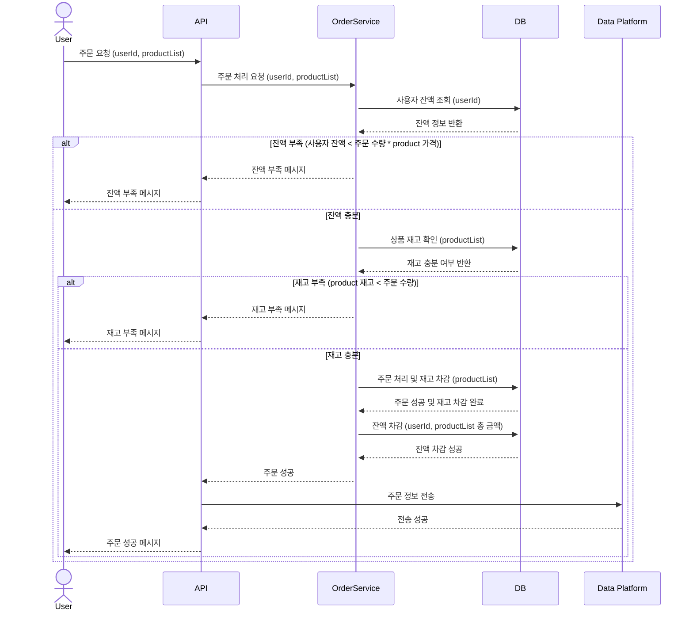

## 주문/결제 API

```mermaid
sequenceDiagram
    actor User
    participant API
    participant OrderService
    participant DB
    participant Data Platform

    User->>API: 주문 요청 (userId, productList)
    API->>OrderService: 주문 처리 요청 (userId, productList)
    activate OrderService
    OrderService->>DB: 사용자 잔액 조회 (userId)
    activate DB
    DB-->>OrderService: 잔액 정보 반환
    alt 잔액 부족 (사용자 잔액 < 주문 수량 * product 가격)
        OrderService-->>API: 잔액 부족 메시지
        API-->>User: 잔액 부족 메시지
    else 잔액 충분
        OrderService->>DB: 상품 재고 확인 (productList)
        DB-->>OrderService: 재고 충분 여부 반환
        alt 재고 부족 (product 재고 < 주문 수량)
            OrderService-->>API: 재고 부족 메시지
            API-->>User: 재고 부족 메시지
        else 재고 충분
            OrderService->>DB: 주문 처리 및 재고 차감 (productList)
            DB-->>OrderService: 주문 성공 및 재고 차감 완료
            OrderService->>DB: 잔액 차감 (userId, productList 총 금액)
            DB-->>OrderService: 잔액 차감 성공
            OrderService-->>API: 주문 성공
            API->>Data Platform: 주문 정보 전송
            Data Platform-->>API: 전송 성공
            API-->>User: 주문 성공 메시지
        end
    end
```