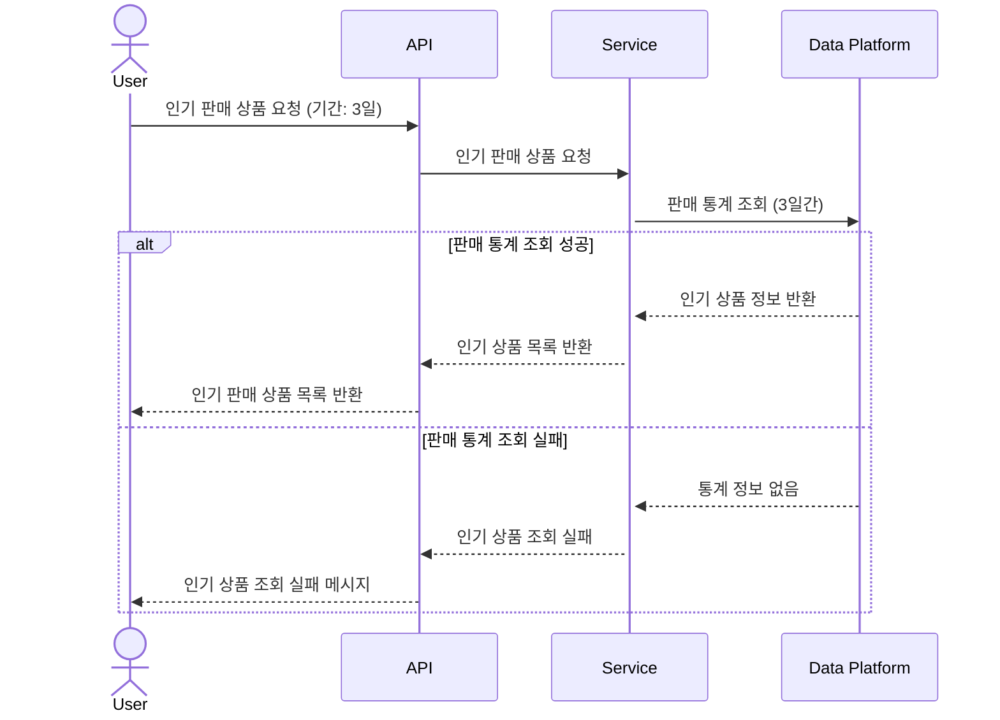

## 인기 상품 조회 API

```mermaid
sequenceDiagram
    actor User
    participant API
    participant Service
    participant Data Platform

    User->>API: 인기 판매 상품 요청 (기간: 3일)
    API->>Service: 인기 판매 상품 요청
    activate Service
    Service->>Data Platform: 판매 통계 조회 (3일간)
    alt 판매 통계 조회 성공
        Data Platform-->>Service: 인기 상품 정보 반환
        Service-->>API: 인기 상품 목록 반환
        API-->>User: 인기 판매 상품 목록 반환
    else 판매 통계 조회 실패
        Data Platform-->>Service: 통계 정보 없음
        Service-->>API: 인기 상품 조회 실패
        API-->>User: 인기 상품 조회 실패 메시지
    end

```