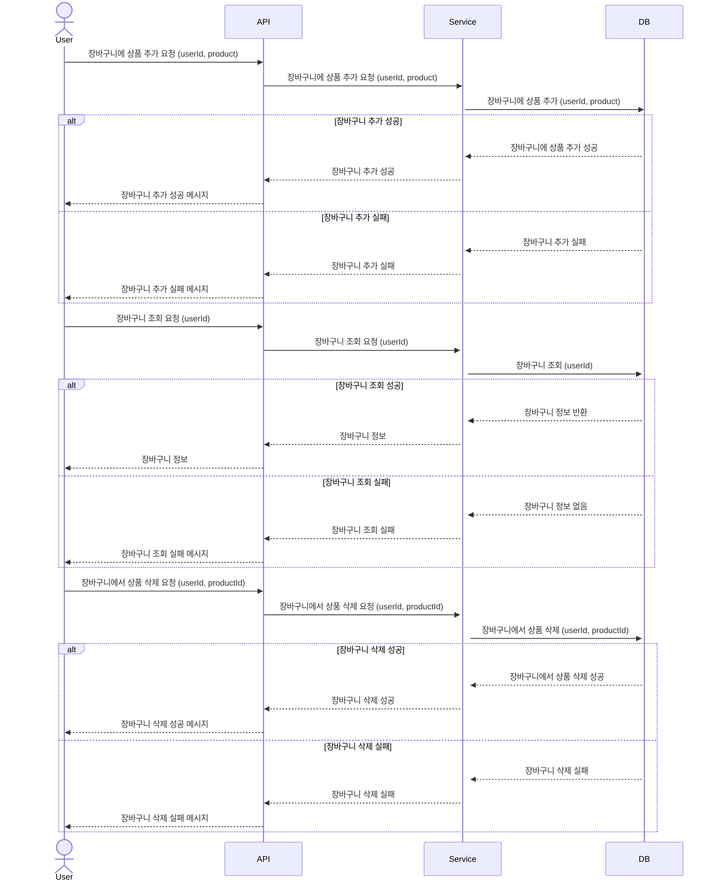

## 장바구니 조회/추가/삭제 API

```mermaid
sequenceDiagram
    actor User
    participant API
    participant Service
    participant DB

%% 장바구니에 상품 추가
    User->>API: 장바구니에 상품 추가 요청 (userId, product)
    API->>Service: 장바구니에 상품 추가 요청 (userId, product)
    activate Service
    Service->>DB: 장바구니에 상품 추가 (userId, product)
    activate DB
    alt 장바구니 추가 성공
        DB-->>Service: 장바구니에 상품 추가 성공
        Service-->>API: 장바구니 추가 성공
        API-->>User: 장바구니 추가 성공 메시지
    else 장바구니 추가 실패
        DB-->>Service: 장바구니 추가 실패
        Service-->>API: 장바구니 추가 실패
        API-->>User: 장바구니 추가 실패 메시지
    end

%% 장바구니 조회
    User->>API: 장바구니 조회 요청 (userId)
    API->>Service: 장바구니 조회 요청 (userId)
    activate Service
    Service->>DB: 장바구니 조회 (userId)
    activate DB
    alt 장바구니 조회 성공
        DB-->>Service: 장바구니 정보 반환
        Service-->>API: 장바구니 정보
        API-->>User: 장바구니 정보
    else 장바구니 조회 실패
        DB-->>Service: 장바구니 정보 없음
        Service-->>API: 장바구니 조회 실패
        API-->>User: 장바구니 조회 실패 메시지
    end

%% 장바구니에서 상품 삭제
    User->>API: 장바구니에서 상품 삭제 요청 (userId, productId)
    API->>Service: 장바구니에서 상품 삭제 요청 (userId, productId)
    activate Service
    Service->>DB: 장바구니에서 상품 삭제 (userId, productId)
    activate DB
    alt 장바구니 삭제 성공
        DB-->>Service: 장바구니에서 상품 삭제 성공
        Service-->>API: 장바구니 삭제 성공
        API-->>User: 장바구니 삭제 성공 메시지
    else 장바구니 삭제 실패
        DB-->>Service: 장바구니 삭제 실패
        Service-->>API: 장바구니 삭제 실패
        API-->>User: 장바구니 삭제 실패 메시지
    end
```