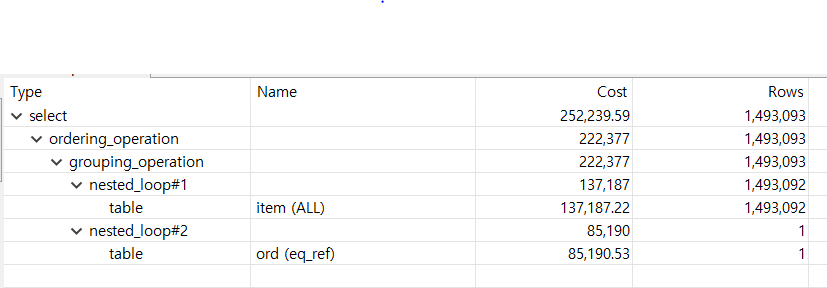
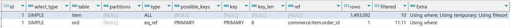
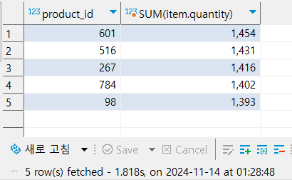
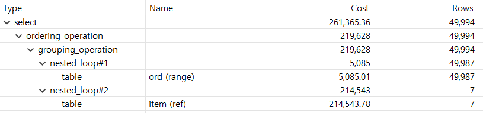
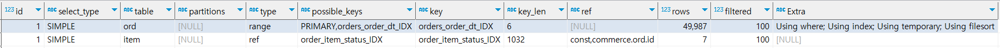
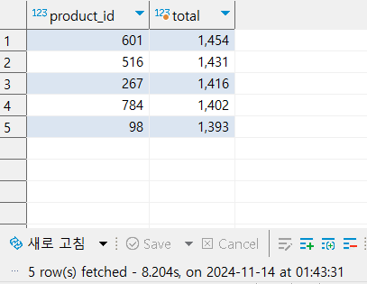

## INDEX 적용하여 쿼리 성능 개선

---

통계 쿼리에 인덱스를 적용해보기 위해, 다음과 같이 더미데이터를 생성했습니다      

           

<br/><br/>


 **최근 10일간 가장 많이 팔린 상품 TOP 5’** 를 조회하는 쿼리이자 성능  개선 대상 쿼리입니다.
````
SELECT item.product_id 
     , SUM(item.quantity) as total
  FROM order_item item
 INNER JOIN orders ord ON item.order_id = ord.id
 WHERE ord.order_dt BETWEEN NOW() - INTERVAL 10 DAY AND NOW()
   AND item.status = 'COMPLETED'
 GROUP BY item.product_id 
 ORDER BY SUM(item.quantity) desc
 LIMIT 5;
````

<br/><br/>

### 1단계 : 현재 쿼리 성능 분석
#### ○ 실행계획



order_item 테이블에는 풀 스캔 방식으로 1,493,093 rows를 조회한다고 합니다.       
orders는 order_item과 join되는 하나의 행만 조회하는 계획을 세웠습니다.

#### ○ 실행결과


**1.818s**의 시간이 소요되었습니다.



<br/>

### 2단계 : 인덱스 적용
내가 조회하고 싶은 데이터의 분포도를 줄여보겠습니다.

조회하고자 하는 데이터는 아래와 같은 조건이 필요합니다.
> 1. 주문 상태가 'COMPLETE'인 데이터
> 2. 최근 3일간 생성된 데이터

>위 조건을 만족하기 위해      
> orders 테이블의 **order_dt** 컬럼과        
> order_item 테이블의 **status, order_id** 컬럼에 인덱스를 각각 생성해주었습니다.

#### ○ 실행계획



range, ref으로 접근방식이 변경되었고 rows는 줄어들었지만 cost는 증가하였음을 확인할 수 있습니다.

#### ○ 실행결과


**8.2044s**의 시간이 소요되었습니다.

<br/>

### 결과
이번 분석을 통해 인덱스 추가가 **반드시 쿼리 성능을 개선하는 것이 아님**을 확인할 수 있었습니다. 
인덱스를 적용한 후, 실행 계획에서 orders 테이블은 range 접근 방식으로, order_item 테이블은 ref 방식으로 인덱스를 적절히 활용한 것으로 보였으나, 
**실제 쿼리 실행 시간은 8초로 예상보다 더 길어졌습니다.**     


#### 원인 분석        
1. 데이터 크기: 인덱스를 사용하여 데이터 검색을 최적화하려 했지만, 데이터가 상대적으로 적다면, 전체 스캔과 같은 간단한 접근 방식이 더 효율적일 수 있습니다.      
2. 인덱스 사용에 따른 추가 비용: 인덱스를 추가한 후, **range**와 **ref** 방식으로 인덱스가 사용되었음에도 불구하고 쿼리 실행 시간이 증가하였습니다. 이는 인덱스를 관리하고 검색하는 데 드는 추가적인 비용이 예상보다 더 큰 영향을 미쳤다고 볼 수 있습니다.


