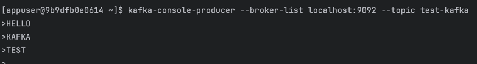
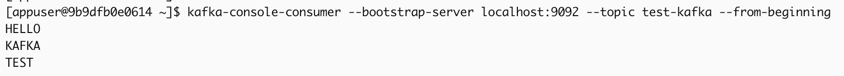

### kafka 연동 테스트

1. spring 애플리케이션 빌드(프로젝트 root. gradlew 파일이 있는 위치)
```
$ ./gradlew clean build
```

2. docker-compose.yml 위치로 이동하여 빌드
```
docker compose up --build -d
```

3. 컨테이너 실행, 확인
```
docker compose up -d
docker ps
```

4. kafka 접속 후 topic 생성
```
docker exec -it kafka bash
kafka-topics --create --bootstrap-server localhost:9092 --topic test-kafka
```

5. 메세지 발행(producer가 실행되면 메세지를 입력)
```
kafka-console-producer --broker-list localhost:9092 --topic test-kafka


>HELLO
>KAFKA
>TEST
```



6. 메세지 소비(다른 터미널에서)
```
docker exec -it kafka bash
kafka-console-consumer --bootstrap-server localhost:9092 --topic test-kafka --from-beginning
```
