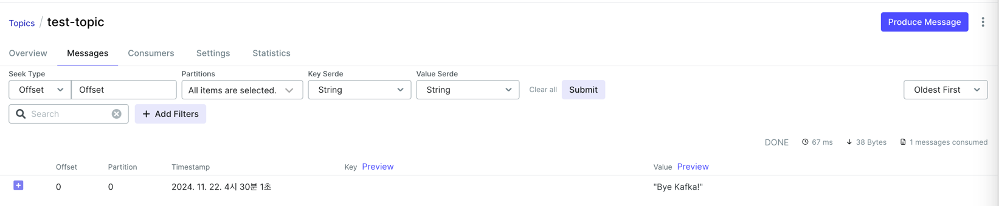

### kafka 연동 테스트(CLI)

1. spring 애플리케이션 빌드(프로젝트 root. gradlew 파일이 있는 위치)
```
$ ./gradlew clean build
```

2. docker-compose.yml 위치로 이동하여 빌드
```
docker compose up --build -d
```

3. 컨테이너 실행, 확인
```
docker compose up -d
docker ps
```

4. kafka 접속 후 topic 생성
```
docker exec -it kafka bash
kafka-topics --create --bootstrap-server localhost:9092 --topic test-kafka
```

5. 메세지 발행(producer가 실행되면 메세지를 입력)
```
kafka-console-producer --broker-list localhost:9092 --topic test-kafka


>HELLO
>KAFKA
>TEST
```


6. 메세지 소비(다른 터미널에서)
```
docker exec -it kafka bash
kafka-console-consumer --bootstrap-server localhost:9092 --topic test-kafka --from-beginning
```


---

### spring에서 kafka 테스트
1. application.yml에 kafka 컨테이너 정보 입력  
```
spring:
  kafka:
    bootstrap-servers: localhost:9092
    consumer:
      group-id: test-group
      auto-offset-reset: earliest
      key-deserializer: org.apache.kafka.common.serialization.StringDeserializer
      value-deserializer: org.springframework.kafka.support.serializer.JsonDeserializer
    producer:
      key-serializer: org.apache.kafka.common.serialization.StringSerializer
      value-serializer: org.springframework.kafka.support.serializer.JsonSerializer
```


2. KafkaMessageProducer 작성
```
@Component
public class KafkaMessageProducer {

    private final KafkaTemplate<String, String> kafkaTemplate;

    @Autowired
    public KafkaMessageProducer(KafkaTemplate<String, String> kafkaTemplate) {
        this.kafkaTemplate = kafkaTemplate;
    }

    public void sendMessage(String message) {
        kafkaTemplate.send("test-topic", message);
        System.out.println("Message sent >>> " + message);
    }
}
```

3. KafkaMessageConsumer 작성
```
@Component
@Slf4j
public class KafkaMessageConsumer {

    @KafkaListener(topics = "test-topic", groupId = "test-group")
    public void consume(String message) {
        log.info("Received message: {}", message);
    }
}
```

4. KafkaController 에서 produce 메소드 호출
```
@RestController
public class KafkaController {
    private final KafkaMessageProducer producer;

    public KafkaController(KafkaMessageProducer producer) {
        this.producer = producer;
    }

    @GetMapping("/send")
    public String sendMessage() {
        producer.sendMessage("Bye Kafka!");
        return "Message sent!";
    }
}
```

5. kafka ui에서 생성된 메시지 확인
