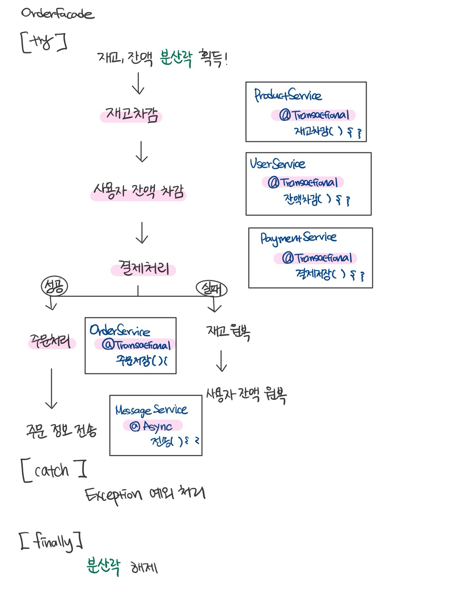

## 서비스 확장 시 트랜잭션 분리 전략

---

### 현재 주문 프로세스
현재 E-commerce 주문 처리 기능은 다음과 같은 단일 프로세스로 운영되고 있습니다:

기능이 각 서비스 내에서 트랜잭션으로 처리되므로 ACID 트랜잭션이 보장됩니다.    
하지만 서비스가 확장되어 트래픽이 증가하거나, 시스템을 MSA로 전환하여 독립적인 서비스로 분리할 경우, **분산 트랜잭션 관리**가 필요하게 됩니다.
  

### 트랜잭션 관리의 한계 및 해결 방안
(1) 일관성 유지의 어려움     
서비스가 분리됨에 따라 데이터 일관성을 보장하기 어려운 문제가 발생할 수 있습니다. 이러한 한계를 극복하기 위해 각 서비스의 로컬 트랜잭션을 완료한 후 이벤트로 통신하여 전체 일관성을 맞추도록 합니다.

(2) 복구 및 재시도 로직     
네트워크 오류나 서비스 중단 시 트랜잭션 실패가 발생할 수 있습니다. 이러한 상황에 대비해 재시도 로직과 복구 정책을 추가하여 시스템의 안정성을 높일 수 있습니다.
  

### 트랜잭션 처리 전략
서비스 분리 시 각 기능 간의 트랜잭션 보장이 어려워질 수 있습니다.
분산 트랜잭션 환경에서의 일관성 유지 방안으로 다음과 같은 전략을 사용할 수 있습니다.

#### 1. SAGA 패턴
SAGA 패턴은 분산 트랜잭션을 보장하기 위해 각 서비스의 작업을 개별 트랜잭션(스텝)으로 관리하는 패턴입니다.
* 특징
    - 보상 트랜잭션: 특정 단계에서 실패 시 이전 단계에서 수행된 작업을 취소하기 위한 트랜잭션
    - 오케스트레이션 방식: 중앙 OrderFacade가 전체 트랜잭션을 관리하며 각 서비스에 트랜잭션 상태를 지시
    - 코레오그라피 방식: 각 서비스가 이벤트 기반으로 트랜잭션을 처리하고, 다른 서비스에 이벤트를 전달하여 다음 단계로 진행

>적용 예시      
(1) 주문 요청이 들어오면 OrderFacade는 ProductService와 UserService에 재고 차감 및 잔액 차감을 요청합니다.      
(2) 재고 또는 잔액이 충분하지 않다면 보상 트랜잭션을 수행하여 이전 단계 작업을 취소합니다.        
(3) 모든 서비스의 작업이 성공적으로 완료되면 PaymentService에서 결제 처리를 수행합니다.        
(4) 결제 성공 시 최종적으로 주문 정보를 OrderService에서 내부 DB에 저장하고, 외부 데이터 플랫폼에 전송합니다.

 

#### 2. 이벤트 기반 비동기 처리

MSA에서는 각 서비스가 독립적으로 처리될 수 있도록 이벤트 기반 비동기 처리를 사용할 수 있습니다. 이를 통해 서비스 간 강한 결합을 피하고, 시스템의 유연성과 확장성을 높일 수 있습니다.      
  * 처리방법
    * 이벤트 발행: 각 서비스는 트랜잭션 완료 후 이벤트를 발행합니다.      
    * 이벤트 구독: 다른 서비스는 관련 이벤트를 구독하여 다음 작업을 수행합니다.
> 적용 예시     
> OrderFacade에서 주문 생성 이벤트가 발생하면 ProductService, UserService, PaymentService, OrderService, MessageService가 이를 수신하여 각각 필요한 처리를 수행합니다.

 

#### 3 보상 트랜잭션 관리
SAGA 패턴과 이벤트 기반 처리가 결합된 경우 보상 트랜잭션이 필요합니다. 주문 도중 특정 서비스에서 오류가 발생하면, 해당 오류를 Order Service로 전달하여 이전 단계에서 완료된 작업들을 취소하도록 합니다.

>적용 예시    
> 결제에 실패하면 ProductServie와 UserService에서 차감한 재고와 차감한 잔액을 원복하는 방식으로 처리합니다.

  

### 결론
"주문 정보 저장"을 수행하는 OrderService 내부에서 DB에 데이터를 저장하고 트랜잭션이 끝날 때, **이벤트 기반 비동기 처리**를 통해 외부 플랫폼에 전송하도록 구현하여 일관성을 유지하도록 합니다.
또한 각 서비스에서 트랜잭션을 처리하도록 분리하고, 예외가 발생하면 **데이터를 원복**할 수 있는 로직을 추가합니다.
이를 통해 서비스 분리로 인한 독립적인 확장성과 유연성을 높이며, 시스템의 신뢰성을 보장할 수 있습니다. 

